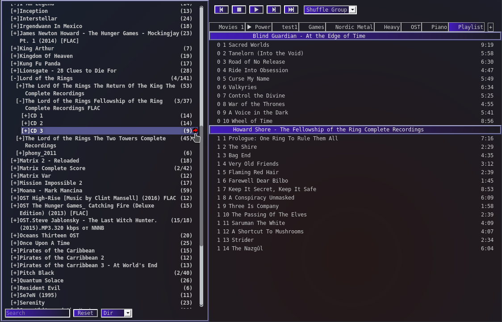

Sambience
=========

Intro
-----

A music server + web-ui bundle, built for a specific purpose.

After trying out a dozen MPD and Mopidy frontends I was disappointed that none had the usability of foobar2000 (including album shuffle).

This is specifically for setting up a hifi station on an RPI and allowing it to play endlessly through a selection of albums.

This is for you if you...

 * want to setup a playlist and let it shuffle endlessly through albums
 * do not need software volume control
 * keep your own music library instead of using streaming services
 * want to control a music player from various devices

 


### Features

 - Playlist Grouped by Artist + Album
 - Playmodes: Album Shuffle, Song Shuffle, Song Repeat, Default
 - Quickly Scan and Update Files through the UI
 - tabbed playlists

#### Intentional Limitations

 - no volume control
 - no seeker
 - no streaming external data or streaming through the UI
 - no duplicate songs in one playlist

#### Possible Future Features

- custom sorting/grouping
- custom metadata attributes
- direct metadata writing


Installation
------------

### Docker

Example for the easy way on raspberry pi 2 or 3:

```sh
#cp and edit settings
cp settings.sample.json /home/user/sambience/settings.json
#build img (designed for rPI)
docker build -t sambience .
#run
docker run \
	--device /dev/snd:/dev/snd \
	-v /media/music:/media \
	-v /home/user/sambience:/data \
	-e APP_CONFIG=/data/settings.json \
	-p 8080:8080 \
	--name sambience \
	sambience
```

### Custom

Requires Node.js, tested with v8.4+

* `npm install` to install dependencies
* `npm run build` to build UI
* `cp settings.sample.json settings.json` and change content as needed depending on your env
* `npm run start` to start the server process

#### CLI

* `node bin/scan.js "PATH"` to scan path for music and add to library
* `node bin/update.js "PATH"` updates files in path, can remove no longer existing files from lib

##### Debugging

Prefix `DEBUG=sambience*` to any command (scanning, starting) to see the debug log

### Configuration

 * database.type - only nedb right now
 * database.music - nedb path to music db file
 * database.playlist - nedb path to playlist db
 * library.allowedFileExtensions - list of file extensions added to database in scan
 * library.baseDirs - list of paths scanned during first start (when index is empty after loading)
 * playback.player - player executable (mplayer/aplay/gst123)
 * core.port - network port to listen to for web-ui